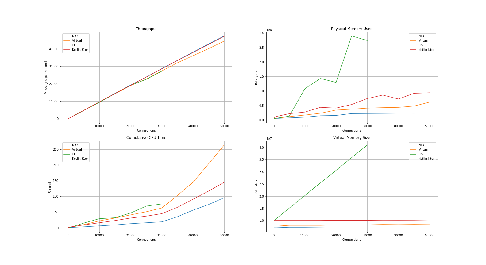

## Overview

This repository contains an echo server implemented with Kotlin and [ktor raw sockets](https://ktor.io/docs/servers-raw-sockets.html).

It is an extension to the [Project Loom Experiment](https://github.com/ebarlas/project-loom-experiment) repository
with the goal of including Kotlin in a comparison of concurrent networking approaches in the Java ecosystem.

## Building

Run the following to build a zip distribution of the echo client application:

```
./gradlew assembleDist
```

The resulting zip is in `build/distributions`.

## Running

To run the echo client, execute the following in the `bin` directory:

```
./kotlin-echo-client <host> <port> <num connections> <message size> <duration ms>
```

## Experiment

For details about the experiment setup, see the [Project Loom Experiment](https://github.com/ebarlas/project-loom-experiment) repository.

## Results

The following diagram contains throughput data points reported by echo client executions and metrics reported by the ps command.



